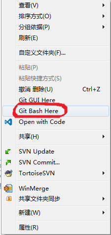

# 学习Git

## Git相关

- [Github提供的15分钟交互式Git入门](https://try.github.io/)
- [如何使用Gitlab的中文介绍](https://zhangmengpl.gitbooks.io/gitlab-guide/content/introduce.html)
- [如何在Gitlab中使用markdown格式？](https://docs.gitlab.com/ce/user/markdown.html)
- [xirong](https://github.com/xirong)整理的[GIT学习资源](https://github.com/xirong/my-git)


### 下载安装
1. 下载地址：https://git-scm.com/downloads
2. 安装：所有的安装选项都按照默认即可(注意要把git bash注册到shell)

### 使用方式
推荐使用GitBash，不建议使用GitGUI。GitBash类似于Windows的CMD环境，只不过其内部集成了一些常用的Linux工具。
注：也可以直接在`cmd`或`powershell`中使用git，需要安装时加入`Path`环境变量。



### 全局配置
示例：

```shell
    git config --global user.name "张继锋"
    git config --global user.email "jifeng_zhang@arcplus.com.cn"
```

### 第一种方式（开始于本地仓库）
1. 创建本地仓库 `git init`
2. 创建README.md说明文件
3. 添加文件到系统 `git add .`
4. 提交到本地仓库 `git commit -m "commit message"`
5. 连接到远程服务器 `git remote add origin https://gitlab.arctron.cn/jifeng/git-demo`
6. 推送到远程服务器 `git push -u origin master`

### 第二种方式（开始于服务器上的项目，即：已存在git的远程服务器地址链接）
1. clone (下载服务器的代码) ： `git clone https://gitlab.arctron.cn/jifeng/git-demo `
2. add： `git add .`
3. commit：  `git commit -m 'commit message'`
4. push：  `git push`

注：不管是第一种方式，还是第二种方式，都可以用如下命令查看当前git仓库的状态

```shell
git status
```

### 已存在一个remote repo的情况

```sh
# 1. 添加一个远程仓库地址，当前git有了两个远程地址，一个是old-origin，另一个是origin
git remote rename origin old-origin
git remote add origin https://gitlab.arctron.cn/jifeng/git-demo.git
# 2. 重新设置远程仓库地址
git remote set-url origin https://gitlab.arctron.cn/jifeng/git-demo.git
git push -u origin --all
git push -u origin --tags
```

### git协作
1. fork别人的项目（界面操作）
2. clone: `git clone https://gitlab.arctron.cn/jifeng/git-demo.git `
3. add     `git add .`
4. commit `git commit -m 'commit message'`
5. push   `git push`
6. add merge request （选择同步到对方的项目）
7. accept merge request (对方)
8. 同步对方项目的修改

    ```shell
        git remote add remote-name remote-url
        git pull remote-name branch-name
        # 示例如下
        git remote add jifeng https://gitlab.arctron.cn/jifeng/git-demo.git
        git pull jifeng master

    ```

### 管理员把开发分支代码发布到主分支

* 第一次签出代码的情况

    ``` shell
    git clone https://gitlab.arctron.cn/jifeng/git-demo.git
    cd bitrix
    git fetch # 获取所有分支
    git rebase origin/master # 衍合到主分支；若遇到冲突，可以abort衍合操作，直接执行下一步
    git checkout master # 签出主分支
    git merge dev # 开发分支代码合并如主分支
    git push # 推送主分支代码到服务器
    ```

* 已签出过代码的情况

    ``` shell
    git fetch # 获取所有分支
    git checkout dev # 签出开发分支，若当前不是开发分支
    git pull -r # 获取最新的开发代码
    git rebase origin/master # 衍合到主分支；若遇到冲突，可以abort衍合操作，直接执行下一步
    git checkout master # 签出主分支
    git merge dev # 开发分支代码合并如主分支
    git push # 推送主分支代码到服务器
    ```

### rebase出错的处理

使用vs code的pull(rebase)出错时，若需要终止rebase，则可以执行如下命令，再push。

``` shell
git rebase --abort
# 1. 因为无法定位分支的情况
git pull -r origin dev
# 2. 因为merge出错等其他情况，此时不会进行rebase
git pull
```

### Git Cheatsheet

下面是[Git Tower](https://www.git-tower.com/blog/git-cheat-sheet-cn)提供的资料：

- [Git命令速查](resources/git-cheatsheet-CN-dark.pdf)
- [Git工作流](resources/workflow-of-version-control.pdf)

以及交互式的[git cheatsheet](https://ndpsoftware.com/git-cheatsheet.html)。若此链接展示有问题，可以下载[本地版](resources/live-git-cheatsheet.zip)。

### 常见问题
1. 如何回退(rollback)未提交(commit)的文件 `git checkout filename`
2. [如何回退已提交文件](http://stackoverflow.com/questions/4114095/revert-git-repo-to-a-previous-commit)
3. 如何删除已被tracking的文件信息而不删除文件 `git rm --cached filename`
4. [如何使用markdown格式写wiki](https://docs.gitlab.com/ce/user/markdown.html)

### Git示例
参考：https://github.com/geeeeeeeeek/git-recipes/

### 使用SSH提交GIT代码(Gitlab)

参考[Gitlab的说明](https://gitlab.arctron.cn/help/ssh/README)

1. 生成Key

    ``` sh
    ssh-keygen -t rsa -C "jifeng_zhang@arcplus.com.cn" # 生成Key
    ```

2. 查看Key

    ```sh
    cat ~/.ssh/id_rsa.pub  # 查看Key
    ```
    
3. 复制到剪切板

    ```sh
    cat ~/.ssh/id_rsa.pub | clip # 复制到剪切板
    ```

4. 添加到本地的SSH配置 (~/.ssh/config)

    ```
    #
    # Main gitlab.arctron.cn server
    #
    Host gitlab.arctron.cn
    RSAAuthentication yes
    IdentityFile ~/my-ssh-key-directory/my-gitlab-private-key-filename
    # User mygitlabusername
    ```

5. 添加到gitlab：https://gitlab.arctron.cn/profile/keys

6. [修改本地的原有库的URL](http://www.cnblogs.com/h07061108/p/url_ssh_https.html)

    ```sh
    git remote set-url origin git@gitlab.arctron.cn:jifeng/git-demo.git
    ```

### 本地两个分支合并操作（一个修改，一个提交）

    注意：切换分支之前，需要当前分支已commit,不然会影响到其他分支；
            可以使用 `git stash`将当前分支已修改代码影响；切回后，在使用 `git stash pop`恢复


1. 新建工作分支 work

    `git checkout -b work`

2. 在work分支上开发代码,并提交
```
    git add content
    git commit -m "message"
```

3. 查看commitId

    `git log -p`

4. 切换至master分支

    `git branch master`

5. 查看操作的 hash id

    `git reflog`

6. 合并work代码至master

    `git cherry-pick hash_id || commit_id`

7. 提交代码至远程仓库

    `git push -u origin master`

8. 删除工作分支work

    `git branch -D work`

9. 下次继续新增work分支
